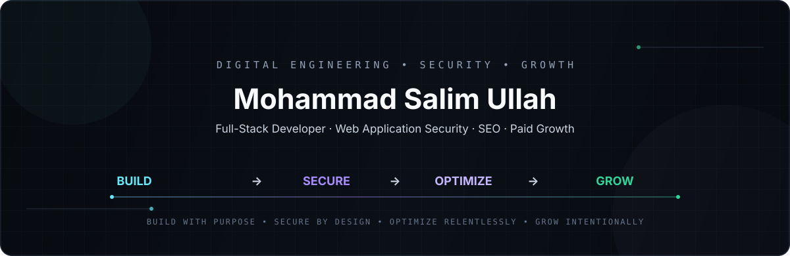

<div align="center">



<br>

<a href="https://meetsalim.lol">
  
</a>
<a href="https://linkedin.com/in/meetsalim">
  
</a>
<a href="mailto:salimmuqtadir7@gmail.com">
  
</a>
<a href="https://x.com/siu7_m">
  
</a>

</div>

---

## `01` — WHO I AM

I'm **Mohammad Salim Ullah**, a multidisciplinary digital professional working across **full-stack engineering, web application security, SEO, and paid growth**.

I build complete digital systems — from the interface and backend architecture to security, performance, discoverability, measurement, and growth.

My work follows one continuous loop:

<div align="center">

**BUILD** &nbsp; → &nbsp; **SECURE** &nbsp; → &nbsp; **OPTIMIZE** &nbsp; → &nbsp; **GROW**

</div>

> **I don't just build websites. I build digital systems, secure them, optimize them, and help them grow.**

---

## `02` — THE FOUR PILLARS

<table>
<tr>
<td width="25%" valign="top">

### `BUILD`

**Full-Stack Engineering**

Designing and developing dynamic web applications from the interface to the database.

- Frontend development
- Backend architecture
- Database-driven systems
- REST APIs
- Authentication
- Authorization
- Responsive applications
- Admin panels
- Maintainable architecture

</td>
<td width="25%" valign="top">

### `SECURE`

**Web Application Security**

Security-aware engineering focused on reducing common application risks.

- OWASP Top 10
- Secure coding
- Authentication
- Authorization
- Access control
- Input validation
- XSS prevention
- SQL injection prevention
- CSRF protection
- Session security
- Security headers

</td>
<td width="25%" valign="top">

### `OPTIMIZE`

**SEO & Performance**

Making digital products faster, more discoverable, and easier to use.

- Technical SEO
- Keyword research
- On-page SEO
- Information architecture
- Crawlability
- Indexation
- Core Web Vitals
- Performance optimization
- Structured content
- Analytics

</td>
<td width="25%" valign="top">

### `GROW`

**Paid Ads & Growth**

Connecting technology, data, acquisition, and conversion.

- Google Ads
- Meta Ads
- Performance marketing
- Conversion tracking
- Landing pages
- CRO
- Campaign optimization
- Analytics
- Growth strategy

</td>
</tr>
</table>

---

## `03` — FLAGSHIP PROJECT

<div align="center">

# DFTI Society

### Development and Future Transformation Initiative Society

**Full-Stack Web Platform · NGO & Training Institute**

<a href="https://dftibd.com">
  
</a>

</div>

> **A complete digital platform engineered from the ground up — not just a website.**

I designed and developed the complete web platform for **Development and Future Transformation Initiative Society (DFTI Society)**, taking responsibility for the overall architecture, frontend, backend, database-driven functionality, responsive experience, security-focused implementation, and centralized administration system.

The platform is **fully dynamic and fully responsive**, with website and organizational content managed through a centralized **admin panel**.

### Architecture

```text
                    ┌───────────────────────┐
                    │      PUBLIC WEB        │
                    │  Responsive Frontend   │
                    └───────────┬───────────┘
                                │
                                ▼
                    ┌───────────────────────┐
                    │   APPLICATION LAYER   │
                    │ Backend + Business     │
                    │ Logic + Validation     │
                    └───────────┬───────────┘
                                │
                 ┌──────────────┴──────────────┐
                 ▼                             ▼
      ┌────────────────────┐       ┌────────────────────┐
      │     DATABASE       │       │     ADMIN PANEL    │
      │ Dynamic Data Model │◄─────►│ Content Management │
      └────────────────────┘       └────────────────────┘
```

### What I Engineered

| Layer | Responsibility |
|---|---|
| **Frontend** | Responsive interface, navigation, content presentation and user experience |
| **Backend** | Application logic, dynamic functionality, authentication and administrative workflows |
| **Database** | Structured relational data and dynamic content |
| **Admin Panel** | Centralized management of website and organizational content |
| **Security** | Security-conscious authentication, authorization, validation and data handling |
| **Optimization** | Responsive delivery, structured content, SEO-conscious architecture and performance |

### The Core Idea

The organization should not need a developer every time routine content changes.

The admin system provides a central place to manage the platform, turning a static web presence into a **maintainable digital system**.

**My Role**

`Full-Stack Developer` · `System Architect` · `Web Application Security`

**Core Stack**

`PHP` · `MySQL` · `JavaScript` · `HTML` · `CSS`

---

## `04` — SECURITY BY DESIGN

<div align="center">

### Security isn't a feature I bolt on at the end.

</div>

I approach web applications with security considerations throughout development — from input boundaries and authentication to authorization, data access, sessions, and output.

```text
UNTRUSTED INPUT
       │
       ▼
┌───────────────┐
│   VALIDATE    │
└───────┬───────┘
        ▼
┌───────────────┐
│   AUTHORIZE   │
└───────┬───────┘
        ▼
┌───────────────┐
│ PROCESS SAFELY │
└───────┬───────┘
        ▼
┌───────────────┐
│ SECURE OUTPUT │
└───────┬───────┘
        ▼
      USER
```

### Areas I Focus On

`OWASP Top 10` · `Authentication` · `Authorization` · `Access Control` · `Input Validation` · `Output Encoding` · `XSS` · `SQL Injection` · `CSRF` · `Session Security` · `Security Headers` · `API Security`

---

## `05` — ENGINEERING STACK

### Development

<p>


</p>

### Data

<p>


</p>

### Security

<p>


</p>

### SEO · Analytics · Growth

<p>


</p>

### Tools

<p>


</p>

---

## `06` — SEO → TRAFFIC → CONVERSION

I treat SEO and paid growth as extensions of engineering rather than completely separate disciplines.

```text
DIGITAL PRODUCT
      │
      ├───────────────┐
      ▼               ▼
 TECHNICAL SEO     PAID ACQUISITION
      │               │
      └───────┬───────┘
              ▼
           TRAFFIC
              │
              ▼
          EXPERIENCE
              │
              ▼
          CONVERSION
              │
              ▼
            GROWTH
```

**Optimization**

`Technical SEO` · `Keyword Research` · `Site Architecture` · `Crawlability` · `Indexation` · `Performance` · `Core Web Vitals` · `Analytics`

**Growth**

`Google Ads` · `Meta Ads` · `Conversion Tracking` · `Landing Pages` · `CRO` · `Performance Marketing` · `Campaign Optimization`

---

## `07` — GITHUB

<div align="center">

<a href="https://github.com/siu7m">
  
</a>
<a href="https://github.com/siu7m">
  
</a>

</div>

---

## `08` — HOW I THINK

```text
                         ┌─────────────┐
                         │     IDEA    │
                         └──────┬──────┘
                                │
                                ▼
                    ┌─────────────────────┐
                    │       BUILD         │
                    │ Architecture + UX   │
                    └──────────┬──────────┘
                               │
                               ▼
                    ┌─────────────────────┐
                    │       SECURE        │
                    │ Risk + Protection   │
                    └──────────┬──────────┘
                               │
                               ▼
                    ┌─────────────────────┐
                    │      OPTIMIZE       │
                    │ SEO + Performance   │
                    └──────────┬──────────┘
                               │
                               ▼
                    ┌─────────────────────┐
                    │        GROW         │
                    │ Data + Acquisition  │
                    └──────────┬──────────┘
                               │
                               └──────────► ITERATE
```

A good digital product isn't finished when it launches.

**Build it. Protect it. Improve it. Grow it. Repeat.**

---

## `09` — CURRENT FOCUS

```text
▸ Full-Stack Web Architecture
▸ Web Application Security
▸ Secure-by-Design Development
▸ Technical SEO
▸ Web Performance
▸ Paid Acquisition
▸ Conversion Optimization
▸ Scalable Digital Systems
```

---

## `10` — LET'S CONNECT

Have a project that needs more than just a website?

I'm interested in projects where **engineering, security, optimization, and growth** need to work together.

<div align="center">

<a href="https://meetsalim.lol">
  
</a>
<a href="https://linkedin.com/in/meetsalim">
  
</a>
<a href="https://x.com/siu7_m">
  
</a>
<a href="mailto:salimmuqtadir7@gmail.com">
  
</a>

<br><br>

**BUILD WITH PURPOSE · SECURE BY DESIGN · OPTIMIZE RELENTLESSLY · GROW INTENTIONALLY**

<br>

`BUILD` → `SECURE` → `OPTIMIZE` → `GROW`

</div>
